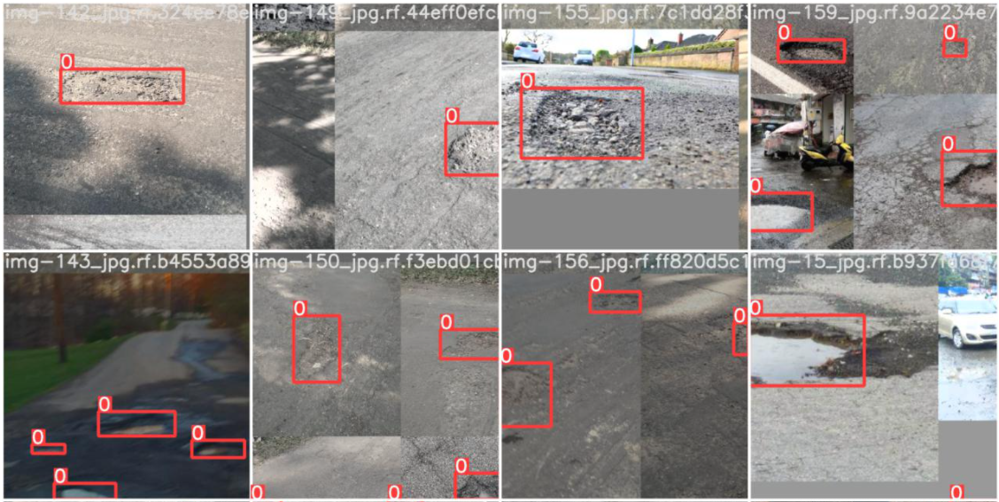

# Pothole-street-detection
### Using YOLOv5 to detect the pothole in street 
### Dataset : https://public.roboflow.com/object-detection/pothole/1

#### Some images with detection:
  
#### Learning metrics: 
  
#### Deploy with Gradio:
  
